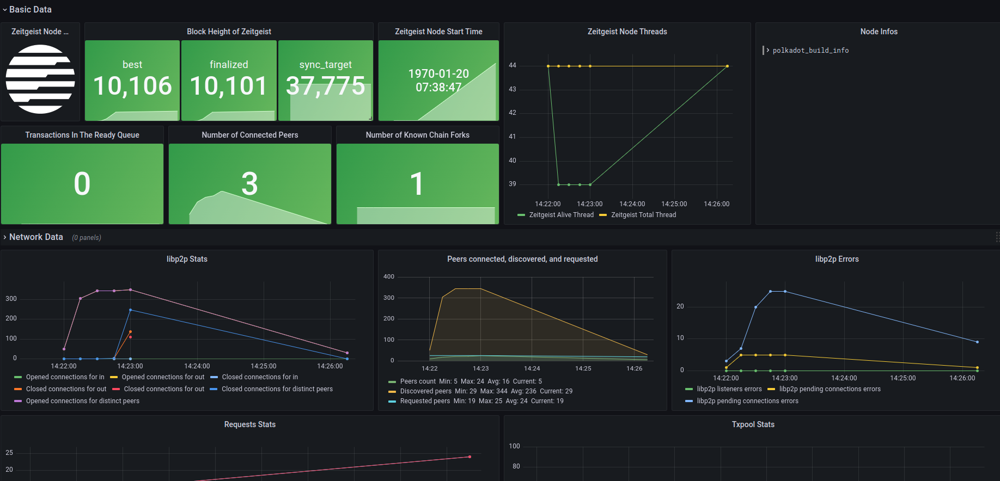

# 如何监控节点信息

<!-- vscode-markdown-toc -->

- 1. [先决条件](#Prerequisites)
- 2. [安装 Prometheus 并配置环境](#InstallPrometheusandconfiguretheenvironment)
  - 2.1. [设置 Prometheus 环境](#ConfigurethePrometheusenvironment)
  - 2.2. [安装 Prometheus](#InstallPrometheus)
  - 2.3. [配置 Prometheus 环境](#ConfigurePrometheusenvironment)
  - 2.4. [运行 Prometheus](#RunPrometheus)
    - 2.4.1. [将 Prometheus 设置为系统服务并自动运行](#SetPrometheusasasystemserviceandrunitautomatically)
- 3. [安装 Grafana 并配置环境](#InstallGrafanaandconfiguretheenvironment)
  - 3.1. [安装 Grafana](#InstallGrafana)
  - 3.2. [运行并将 Grafana 作为系统服务自动运行](#RunandautomaticallyrunGrafanaasasystemservice)
  - 3.3. [配置 Grafana 数据源](#ConfigureGrafanadatasource)
- 4. [监控 Zeitgeist 节点信息](#MonitorZeitgeistnodemetrics)
- 5. [Reference](#Reference)

<!-- vscode-markdown-toc-config
	numbering=true
	autoSave=true
	/vscode-markdown-toc-config -->
<!-- /vscode-markdown-toc -->

## 1. <a name='Prerequisites'></a>先决条件

准备好节点运行环境，具体信息可以遵循[这篇文章](https://docs.zeitgeist.pm/battery-station)

## 2. <a name='InstallPrometheusandconfiguretheenvironment'></a>安装 Prometheus 并配置环境

我们采用 [Prometheus](https://prometheus.io/docs/introduction/overview/) 作为节点数据的采集工具

### 2.1. <a name='ConfigurethePrometheusenvironment'></a>设置 Prometheus 环境

1. 为防止 Prometheus 登陆，我们需要设置 `--no-create-home` 同时为 Prometheus 创建用户

   ```bash
   sudo useradd --no-create-home --shell /usr/sbin/nologin prometheus
   ```

2. 创建存储配置和可执行文件所在的目录

   ```bash
   sudo mkdir /etc/prometheus
   sudo mkdir /var/lib/prometheus
   ```

3. 修改文件夹所属权

   ```bash
   sudo chown -R prometheus:prometheus /etc/prometheus
   sudo chown -R prometheus:prometheus /var/lib/prometheus
   ```

### 2.2. <a name='InstallPrometheus'></a>安装 Prometheus

1. 设置完环境后我们开始安装，大家可以通过官方 Github Repo 的 [Releases](https://github.com/prometheus/prometheus/releases) 中查看最新版本

   ```bash
   sudo apt-get update && apt-get upgrade
   wget https://github.com/prometheus/prometheus/releases/download/v2.32.1/prometheus-2.32.1.linux-amd64.tar.gz
   tar xfz prometheus-*.tar.gz
   cd prometheus-2.32.1.linux-amd64
   ```

2. 下载完成后当前路径文件夹将会有两个可执行文件以及两个文件夹：

   

3. 将可执行文件复制到指定文件夹并修改所属权：

   ```bash
   sudo cp ./prometheus /usr/local/bin/
   sudo cp ./promtool /usr/local/bin/
   sudo chown prometheus:prometheus /usr/local/bin/prometheus
   sudo chown prometheus:prometheus /usr/local/bin/promtool
   ```

4. 将文件夹复制到指定文件夹并修改所属权：

   ```bash
   sudo cp -r ./consoles /etc/prometheus
   sudo cp -r ./console_libraries /etc/prometheus
   sudo chown -R prometheus:prometheus /etc/prometheus/consoles
   sudo chown -R prometheus:prometheus /etc/prometheus/console_libraries
   ```

5. 删除冗余文件夹

   ```bash
   cd .. && rm -rf prometheus*
   ```

6. 测试 Prometheus 安装是否成功

   ```bash
   promtool check config /etc/prometheus/prometheus.yml
   ```

7. 修改配置文件的所属权

   ```bash
   sudo chown prometheus:prometheus /etc/prometheus/prometheus.yml
   ```

你也可以选择通过官方文档进行安装

https://prometheus.io/docs/prometheus/latest/installation/

### 2.3. <a name='ConfigurePrometheusenvironment'></a>配置 Prometheus 环境

安装完成之后，我们需要对 Prometheus 的环境进行配置，操作如下：

```bash
sudo vim /etc/prometheus/prometheus.yml
```

填入：

```yaml
global:
  scrape_interval: 15s
  evaluation_interval: 15s

rule_files:
  # - "first.rules"
  # - "second.rules"

scrape_configs:
  - job_name: "prometheus"
    scrape_interval: 5s
    static_configs:
      - targets: ["localhost:9090"]
  - job_name: "zeitgeist_node"
    scrape_interval: 5s
    static_configs:
      - targets: ["localhost:9616"]
```

### 2.4. <a name='RunPrometheus'></a>运行 Prometheus

在 Terminal 中运行下面的命令：

```bash
sudo -u prometheus /usr/local/bin/prometheus --config.file /etc/prometheus/prometheus.yml --storage.tsdb.path /var/lib/prometheus/ --web.console.templates=/etc/prometheus/consoles --web.console.libraries=/etc/prometheus/console_libraries
```

运行成功后会打印出相关日志。

在浏览器中输入 `http://127.0.0.1:9090/graph` 可以查看以及查询相关信息

#### 2.4.1. <a name='SetPrometheusasasystemserviceandrunitautomatically'></a>将 Prometheus 设置为系统服务并自动运行

1. 创建 service 文件

   ```bash
   sudo vim /etc/systemd/system/prometheus.service
   ```

2. 输入以下配置：

   ```
   [Unit]
     Description=Prometheus Monitoring
     Wants=network-online.target
     After=network-online.target

   [Service]
     User=prometheus
     Group=prometheus
     Type=simple
     ExecStart=/usr/local/bin/prometheus \
     --config.file /etc/prometheus/prometheus.yml \
     --storage.tsdb.path /var/lib/prometheus/ \
     --web.console.templates=/etc/prometheus/consoles \
     --web.console.libraries=/etc/prometheus/console_libraries
     ExecReload=/bin/kill -HUP $MAINPID

   [Install]
     WantedBy=multi-user.target
   ```

3. 重新加载 `systemd` 并启动服务：

   ```bash
   sudo systemctl daemon-reload && systemctl enable prometheus && systemctl start prometheus
   ```

## 3. <a name='InstallGrafanaandconfiguretheenvironment'></a>安装 Grafana 并配置环境

我们使用 [Grafana](https://grafana.com/grafana/) 作为节点信息的可视化工具，Grafana 将会捕捉 Prometheus 提供的数据并实时可视化输出，给节点运营商更直观的体验

### 3.1. <a name='InstallGrafana'></a>安装 Grafana

在 Terminal 中输入：

```bash
sudo apt-get install -y adduser libfontconfig1
wget https://dl.grafana.com/oss/release/grafana_8.3.3_amd64.deb
sudo dpkg -i grafana_8.3.3_amd64.deb
```

具体的[最新版本](https://grafana.com/grafana/download)可以在 Grafana 官方网站上找到

### 3.2. <a name='RunandautomaticallyrunGrafanaasasystemservice'></a>运行并将 Grafana 作为系统服务自动运行

在 Terminal 中输入：

```bash
sudo systemctl daemon-reload
sudo systemctl enable grafana-server
sudo systemctl start grafana-server
```

### 3.3. <a name='ConfigureGrafanadatasource'></a>配置 Grafana 数据源

1. 在浏览器中输入以下 IP 并登陆：`http://127.0.0.1:3000/login` ，默认帐号密码均为 `admin` 。

2. 在左边找到 `Configuration` 按钮，选择 `Data Sources` ，进入后选择添加数据源 `Add data source` 。
3. 大家可以根据自己使用的数据源来进行选择，**本文中我们选择的是 `Prometheus` **。
4. 设置数据源参数，将 `URL` 设置为 `http://localhost:9090` 即可，选择最下面的 `Save & Test` ，如果看到 `Data source is working` 则说明配置没有问题。

## 4. <a name='MonitorZeitgeistnodemetrics'></a>监控 Zeitgeist 节点信息

在完成以上所有配置之后，我们可以导入预先设计好的 [Dashboard](https://grafana.com/grafana/dashboards/15424) 对节点关键信息进行监控。

1. 在菜单栏的 `Create` 一栏中选择 `Import` ，我们可以选择从 grafana.com 社区中利用 ID 进行导入或者通过此链接中的 [Json 文件](https://github.com/Whisker17/Zeitgeist-Node-Monitor/blob/main/Zeitgeist%20Node%20Monitor-1640048954974.json)进行导入。

2. 选择 `Load` ，再次确认 `Prometheus` 这一栏没有选错，点击 `Import` 。

3. 在本地运行 Zeitgeist 节点，请使用下面的命令行执行（目前仅支持二进制文件运行）

   ```bash
   ./zeitgeist --chain=battery_station --pruning=archive --prometheus-port=9616
   ```

4. 等待几秒后，您将会在界面中看到数据的更新。

   

## 5. <a name='Reference'></a>Reference

- [Monitor your node](https://wiki.polkadot.network/docs/maintain-guides-how-to-monitor-your-node)
